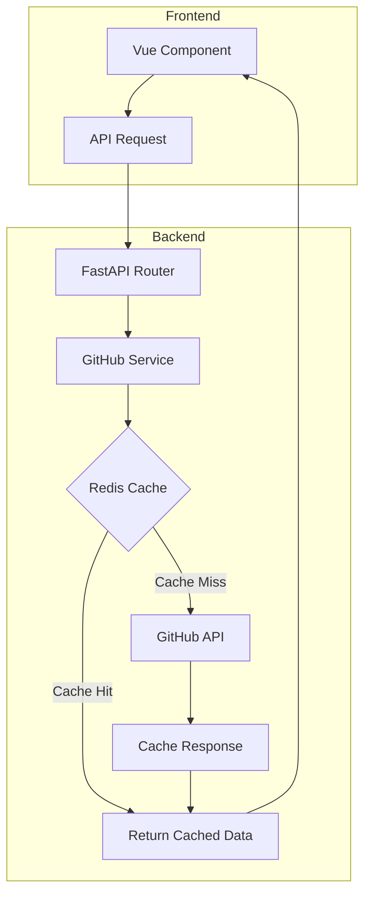

# Design Document: GitHub 热点 Python 项目汇总

## Overview

本设计实现一个 GitHub 热点项目汇总功能，通过 GitHub Search API 获取当月最热门的 30 个 Python 项目，并在前端以卡片列表形式展示。系统采用 Redis 缓存策略减少 API 调用频率，提高响应速度。

## Architecture



### 数据流

1. 前端组件发起 GET 请求到 `/api/github/trending`
2. 后端路由调用 GitHub Service
3. Service 首先检查 Redis 缓存
4. 缓存命中则直接返回；缓存未命中则调用 GitHub API
5. 获取数据后存入 Redis 并返回给前端
6. 前端渲染项目卡片列表

## Components and Interfaces

### Backend Components

#### 1. GitHub Service (`backend/app/services/github_service.py`)

```python
from typing import Optional
from pydantic import BaseModel

class TrendingProject(BaseModel):
    """热门项目数据模型"""
    name: str
    full_name: str
    description: Optional[str]
    stars: int
    forks: int
    url: str
    author: str
    language: str
    created_at: str
    updated_at: str

async def get_trending_python_projects(limit: int = 30) -> list[TrendingProject]:
    """
    获取热门 Python 项目
    
    Args:
        limit: 返回项目数量，默认30
        
    Returns:
        TrendingProject 列表
    """
    pass

def _build_search_query() -> str:
    """构建 GitHub 搜索查询字符串"""
    pass

async def _fetch_from_github(query: str, limit: int) -> list[dict]:
    """从 GitHub API 获取数据"""
    pass

def _get_cached_projects() -> Optional[list[TrendingProject]]:
    """从 Redis 获取缓存数据"""
    pass

def _cache_projects(projects: list[TrendingProject]) -> None:
    """将项目数据缓存到 Redis"""
    pass
```

#### 2. GitHub Router (`backend/app/api/routes/github.py`)

```python
from fastapi import APIRouter

router = APIRouter(prefix="/github", tags=["github"])

@router.get("/trending")
async def get_trending_projects():
    """获取热门 Python 项目列表"""
    pass
```

### Frontend Components

#### 3. GitHub Trending View (`frontend/src/views/GithubTrendingView.vue`)

Vue 组件负责：
- 页面加载时自动获取数据
- 展示项目卡片列表
- 处理加载状态和错误状态
- 提供刷新功能

### API Interface

#### GET /api/github/trending

**Response 200:**
```json
{
  "projects": [
    {
      "name": "project-name",
      "full_name": "author/project-name",
      "description": "项目描述",
      "stars": 12345,
      "forks": 1234,
      "url": "https://github.com/author/project-name",
      "author": "author",
      "language": "Python",
      "created_at": "2026-01-01T00:00:00Z",
      "updated_at": "2026-01-06T00:00:00Z"
    }
  ],
  "cached": true,
  "updated_at": "2026-01-06T10:00:00Z"
}
```

**Response 500:**
```json
{
  "detail": "获取 GitHub 数据失败"
}
```

## Data Models

### TrendingProject Schema

| 字段 | 类型 | 描述 |
|------|------|------|
| name | string | 项目名称 |
| full_name | string | 完整名称 (author/repo) |
| description | string? | 项目描述 |
| stars | int | 星标数 |
| forks | int | Fork 数 |
| url | string | GitHub 项目链接 |
| author | string | 作者/组织名 |
| language | string | 主要编程语言 |
| created_at | string | 创建时间 (ISO 8601) |
| updated_at | string | 最后更新时间 (ISO 8601) |

### Redis Cache Structure

- **Key**: `github:trending:python`
- **Value**: JSON 序列化的项目列表
- **TTL**: 3600 秒 (1 小时)

## Correctness Properties

*A property is a characteristic or behavior that should hold true across all valid executions of a system-essentially, a formal statement about what the system should do. Properties serve as the bridge between human-readable specifications and machine-verifiable correctness guarantees.*

### Property 1: 项目列表排序正确性

*For any* 返回的热门项目列表，列表中的项目应按星标数（stars）降序排列，即对于列表中任意相邻的两个项目 `projects[i]` 和 `projects[i+1]`，应满足 `projects[i].stars >= projects[i+1].stars`。

**Validates: Requirements 1.2**

### Property 2: 项目数据完整性

*For any* 返回的 TrendingProject 对象，必须包含所有必需字段：name（非空字符串）、full_name（非空字符串）、stars（非负整数）、forks（非负整数）、url（有效 URL 格式）、author（非空字符串）、language（字符串）、created_at（ISO 8601 格式）、updated_at（ISO 8601 格式）。

**Validates: Requirements 1.3, 3.3**

### Property 3: 项目数量限制

*For any* 调用 `get_trending_python_projects(limit=N)` 的返回结果，返回的项目列表长度应满足 `0 <= len(projects) <= N`。

**Validates: Requirements 1.2**

### Property 4: 前端渲染数据完整性

*For any* 渲染的项目卡片，显示的内容应包含项目名称、描述（如有）、星标数、Fork 数和可点击的项目链接。

**Validates: Requirements 4.3**

## Error Handling

### Backend Error Handling

| 错误场景 | HTTP 状态码 | 错误消息 | 处理方式 |
|---------|------------|---------|---------|
| GitHub API 请求超时 | 500 | "GitHub API 请求超时" | 记录日志，返回错误响应 |
| GitHub API 返回错误 | 500 | "获取 GitHub 数据失败" | 记录日志，返回错误响应 |
| GitHub API 速率限制 | 503 | "GitHub API 请求频率超限，请稍后重试" | 记录日志，返回错误响应 |
| Redis 连接失败 | - | - | 降级处理，直接请求 GitHub API |
| 数据解析错误 | 500 | "数据解析失败" | 记录日志，返回错误响应 |

### Frontend Error Handling

| 错误场景 | 用户提示 | 处理方式 |
|---------|---------|---------|
| API 请求失败 | "获取数据失败，请点击重试" | 显示错误提示和重试按钮 |
| 网络错误 | "网络连接失败，请检查网络" | 显示错误提示和重试按钮 |
| 数据为空 | "暂无热门项目" | 显示空状态提示 |

## Testing Strategy

### 单元测试

使用 `pytest` 进行后端单元测试：

1. **GitHub Service 测试**
   - 测试查询字符串构建
   - 测试数据转换逻辑
   - 测试缓存读写逻辑（使用 mock Redis）
   - 测试错误处理

2. **API 端点测试**
   - 测试成功响应格式
   - 测试错误响应格式

### 属性测试

使用 `hypothesis` 进行属性测试：

1. **Property 1 测试**: 生成随机项目列表，验证排序后满足降序条件
2. **Property 2 测试**: 生成随机 API 响应数据，验证转换后的对象包含所有必需字段
3. **Property 3 测试**: 使用不同的 limit 参数，验证返回列表长度约束

### 集成测试

1. 测试完整的请求-响应流程
2. 测试缓存命中和未命中场景
3. 测试 GitHub API 模拟响应

### 前端测试

使用 Vue Test Utils：

1. 组件挂载测试
2. 数据渲染测试
3. 用户交互测试（刷新按钮）
4. 加载状态和错误状态测试

