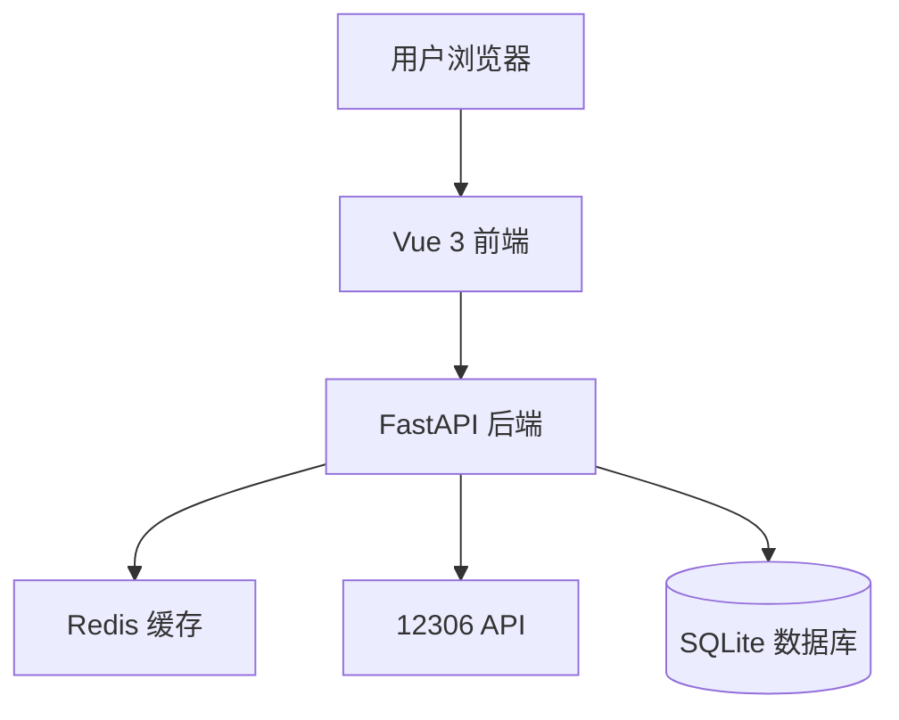

# Design Document: 火车票查询系统

## Overview

火车票查询系统是一个集成12306官方接口的Web应用，为用户提供便捷的火车票查询服务。系统采用前后端分离架构，后端使用FastAPI提供RESTful API，前端使用Vue 3构建用户界面。系统通过代理方式访问12306接口，实现车站查询、车次查询、余票查询等核心功能，并通过Redis缓存提升性能。

## Architecture

### 系统架构图



### 技术栈

**后端**:
- FastAPI 0.111.0 - Web框架
- httpx 0.27.0 - HTTP客户端（用于调用12306 API）
- Redis 5.0.7 - 缓存层
- SQLModel 0.0.21 - 数据模型和持久化

**前端**:
- Vue 3.4.27 - UI框架
- Vite 4.4.9 - 构建工具
- Axios - HTTP客户端

### 架构特点

1. **前后端分离**: 前端和后端独立部署，通过RESTful API通信
2. **缓存策略**: 使用Redis缓存查询结果，减少对12306的请求压力
3. **代理模式**: 后端作为代理层，封装12306 API的复杂性
4. **异步处理**: 使用FastAPI的异步特性提高并发处理能力

## Components and Interfaces

### 后端组件

#### 1. TrainService (app/services/train_service.py)

负责与12306 API交互的核心服务类。

```python
class TrainService:
    """火车票查询服务"""
    
    def __init__(self, redis_client: Redis, http_client: httpx.AsyncClient):
        self.redis = redis_client
        self.http_client = http_client
        self.base_url = "https://kyfw.12306.cn"
    
    async def search_stations(self, keyword: str) -> List[Station]:
        """搜索车站
        
        Args:
            keyword: 站点名称或拼音首字母
            
        Returns:
            匹配的站点列表
        """
        pass
    
    async def query_trains(
        self, 
        from_station: str, 
        to_station: str, 
        date: str
    ) -> List[TrainInfo]:
        """查询车次
        
        Args:
            from_station: 出发站代码
            to_station: 到达站代码
            date: 出发日期 (YYYY-MM-DD)
            
        Returns:
            车次信息列表
        """
        pass
    
    async def get_ticket_price(
        self, 
        train_no: str, 
        from_station: str, 
        to_station: str, 
        seat_type: str
    ) -> float:
        """获取票价
        
        Args:
            train_no: 车次号
            from_station: 出发站代码
            to_station: 到达站代码
            seat_type: 座位类型
            
        Returns:
            票价（元）
        """
        pass

    async def _get_cached_result(self, cache_key: str) -> Optional[dict]:
        """从缓存获取结果"""
        pass
    
    async def _set_cached_result(self, cache_key: str, data: dict, ttl: int = 300):
        """设置缓存结果"""
        pass
```

#### 2. API Routes (app/api/routes/train.py)

提供RESTful API端点。

```python
from fastapi import APIRouter, Depends, HTTPException, Query
from typing import List
from datetime import date

router = APIRouter(prefix="/api/train", tags=["train"])

@router.get("/stations")
async def search_stations(
    keyword: str = Query(..., min_length=1, description="站点名称或拼音"),
    service: TrainService = Depends(get_train_service)
) -> List[StationResponse]:
    """搜索车站"""
    pass

@router.get("/query")
async def query_trains(
    from_station: str = Query(..., description="出发站代码"),
    to_station: str = Query(..., description="到达站代码"),
    date: date = Query(..., description="出发日期"),
    service: TrainService = Depends(get_train_service)
) -> TrainQueryResponse:
    """查询车次"""
    pass

@router.get("/refresh")
async def refresh_query(
    from_station: str,
    to_station: str,
    date: date,
    service: TrainService = Depends(get_train_service)
) -> TrainQueryResponse:
    """刷新查询（绕过缓存）"""
    pass
```

#### 3. Cache Manager (app/core/cache.py)

统一的缓存管理器。

```python
class CacheManager:
    """缓存管理器"""
    
    def __init__(self, redis_client: Redis):
        self.redis = redis_client
    
    async def get(self, key: str) -> Optional[str]:
        """获取缓存"""
        pass
    
    async def set(self, key: str, value: str, ttl: int = 300):
        """设置缓存"""
        pass
    
    async def delete(self, key: str):
        """删除缓存"""
        pass
    
    def generate_cache_key(self, prefix: str, **kwargs) -> str:
        """生成缓存键"""
        pass
```

### 前端组件

#### 1. TrainQueryView.vue

主查询页面组件。

```javascript
<template>
  <div class="train-query-container">
    <div class="query-form">
      <StationSelector 
        v-model="fromStation" 
        placeholder="出发站"
      />
      <StationSelector 
        v-model="toStation" 
        placeholder="到达站"
      />
      <DatePicker 
        v-model="departDate" 
        :min-date="today"
        :max-date="maxDate"
      />
      <Button @click="handleQuery" :loading="loading">查询</Button>
    </div>
    
    <QueryHistory 
      @select="handleHistorySelect"
    />
    
    <TrainList 
      :trains="trainList" 
      :loading="loading"
      @refresh="handleRefresh"
    />
  </div>
</template>

<script setup>
import { ref, computed } from 'vue'
import { useTrainQuery } from '@/composables/useTrainQuery'

const { 
  queryTrains, 
  trainList, 
  loading, 
  error 
} = useTrainQuery()

// 组件逻辑
</script>
```

#### 2. useTrainQuery Composable

封装查询逻辑的组合式函数。

```javascript
export function useTrainQuery() {
  const trainList = ref([])
  const loading = ref(false)
  const error = ref(null)
  
  const queryTrains = async (params) => {
    loading.value = true
    error.value = null
    
    try {
      const response = await api.get('/api/train/query', { params })
      trainList.value = response.data.trains
      saveQueryHistory(params)
    } catch (err) {
      error.value = err.message
    } finally {
      loading.value = false
    }
  }
  
  const refreshQuery = async (params) => {
    // 绕过缓存刷新
  }
  
  return {
    trainList,
    loading,
    error,
    queryTrains,
    refreshQuery
  }
}
```

## Data Models

### Station (车站信息)

```python
from sqlmodel import SQLModel, Field
from typing import Optional

class Station(SQLModel):
    """车站信息模型"""
    code: str = Field(primary_key=True, description="站点代码")
    name: str = Field(index=True, description="站点名称")
    pinyin: str = Field(index=True, description="拼音全拼")
    py_code: str = Field(index=True, description="拼音首字母")
    
class StationResponse(SQLModel):
    """车站响应模型"""
    code: str
    name: str
    pinyin: str
```

### TrainInfo (车次信息)

```python
from datetime import time
from typing import Dict, Optional

class SeatInfo(SQLModel):
    """座位信息"""
    seat_type: str = Field(description="座位类型")
    seat_name: str = Field(description="座位名称")
    available: int = Field(description="余票数量，-1表示无票")
    price: Optional[float] = Field(default=None, description="票价")

class TrainInfo(SQLModel):
    """车次信息模型"""
    train_no: str = Field(description="车次号")
    train_type: str = Field(description="车次类型：G/D/C/K/T等")
    from_station_code: str = Field(description="出发站代码")
    from_station_name: str = Field(description="出发站名称")
    to_station_code: str = Field(description="到达站代码")
    to_station_name: str = Field(description="到达站名称")
    start_time: str = Field(description="出发时间 HH:MM")
    arrive_time: str = Field(description="到达时间 HH:MM")
    duration: str = Field(description="运行时长 HH:MM")
    seats: List[SeatInfo] = Field(default_factory=list, description="座位信息列表")
    can_buy: bool = Field(default=True, description="是否可购买")
    
class TrainQueryResponse(SQLModel):
    """查询响应模型"""
    trains: List[TrainInfo]
    query_time: str = Field(description="查询时间")
    from_cache: bool = Field(default=False, description="是否来自缓存")
    total: int = Field(description="结果总数")
```

### QueryHistory (查询历史)

```python
from datetime import datetime

class QueryHistory(SQLModel, table=True):
    """查询历史模型"""
    id: Optional[int] = Field(default=None, primary_key=True)
    from_station_code: str
    from_station_name: str
    to_station_code: str
    to_station_name: str
    depart_date: str
    query_time: datetime = Field(default_factory=datetime.now)
    user_id: Optional[int] = Field(default=None, foreign_key="user.id")
```

## 12306 API Integration

### API端点映射

```python
class Train12306API:
    """12306 API端点配置"""
    
    # 基础URL
    BASE_URL = "https://kyfw.12306.cn"
    
    # 车站查询
    STATION_URL = f"{BASE_URL}/otn/resources/js/framework/station_name.js"
    
    # 车次查询
    QUERY_URL = f"{BASE_URL}/otn/leftTicket/query"
    
    # 票价查询
    PRICE_URL = f"{BASE_URL}/otn/leftTicket/queryTicketPrice"
```

### 请求头配置

```python
DEFAULT_HEADERS = {
    "User-Agent": "Mozilla/5.0 (Windows NT 10.0; Win64; x64) AppleWebKit/537.36",
    "Referer": "https://kyfw.12306.cn/otn/leftTicket/init",
    "Accept": "application/json, text/javascript, */*; q=0.01",
    "Accept-Language": "zh-CN,zh;q=0.9,en;q=0.8",
}
```

### 数据解析

12306返回的数据需要解析和转换：

```python
def parse_train_data(raw_data: str) -> TrainInfo:
    """解析12306返回的车次数据
    
    12306返回格式：用|分隔的字符串
    索引说明：
    0: 密钥
    3: 车次号
    6: 出发站代码
    7: 到达站代码
    8: 出发时间
    9: 到达时间
    10: 运行时长
    32: 商务座
    31: 一等座
    30: 二等座
    ...
    """
    fields = raw_data.split('|')
    
    return TrainInfo(
        train_no=fields[3],
        train_type=fields[3][0],
        from_station_code=fields[6],
        to_station_code=fields[7],
        start_time=fields[8],
        arrive_time=fields[9],
        duration=fields[10],
        seats=parse_seat_info(fields)
    )
```

## Correctness Properties

*属性（Property）是系统在所有有效执行中都应该保持为真的特征或行为——本质上是关于系统应该做什么的形式化陈述。属性是人类可读规范和机器可验证正确性保证之间的桥梁。*


### 核心正确性属性

Property 1: 站点搜索匹配性
*For any* 搜索关键字（站点名称或拼音首字母），搜索返回的所有站点都应该在名称或拼音中包含该关键字
**Validates: Requirements 1.1, 1.4**

Property 2: 站点信息完整性
*For any* 站点对象，其显示结果应该包含站点名称和站点代码
**Validates: Requirements 1.2**

Property 3: 站点选择持久化
*For any* 用户选择的站点，系统状态中应该正确保存该站点作为出发地或目的地
**Validates: Requirements 1.3**

Property 4: 日期验证规则
*For any* 日期输入，系统应该接受当前日期起30天内的日期，并拒绝其他日期
**Validates: Requirements 2.2**

Property 5: 查询触发API调用
*For any* 有效的查询参数（出发地、目的地、日期），系统应该调用12306 API
**Validates: Requirements 3.1**

Property 6: 查询结果完整性
*For any* 成功的API响应，系统应该返回响应中的所有车次信息
**Validates: Requirements 3.2**

Property 7: 错误处理完整性
*For any* 查询失败场景（网络错误、API错误、参数错误），系统应该显示相应的错误提示信息
**Validates: Requirements 3.3, 7.2, 7.3**

Property 8: 12306数据解析正确性
*For any* 12306 API返回的原始数据格式，解析后的TrainInfo对象应该包含所有必需字段且数据类型正确
**Validates: Requirements 3.5**

Property 9: 车次信息显示完整性
*For any* 车次对象，其显示结果应该包含车次号、出发时间、到达时间、运行时长、所有座位类型的余票信息和票价
**Validates: Requirements 4.1, 4.2, 5.1, 5.2**

Property 10: 车次排序不变性
*For any* 车次列表，排序后的列表应该按出发时间升序排列
**Validates: Requirements 4.4**

Property 11: 车次类型识别
*For any* 车次号，系统应该根据首字母正确识别车次类型（G=高铁, D=动车, C=城际, K=快速, T=特快等）
**Validates: Requirements 4.5**

Property 12: 余票显示格式
*For any* 余票数量，当数量大于0时应该显示具体数量或"有"，当数量为0时应该显示"无"或"--"
**Validates: Requirements 5.3**

Property 13: 查询历史保存
*For any* 完成的查询，系统应该将查询记录保存到本地存储
**Validates: Requirements 6.1**

Property 14: 历史记录数量限制
*For any* 查询历史列表，系统应该只保留最近10条记录
**Validates: Requirements 6.2**

Property 15: 历史记录显示完整性
*For any* 历史记录，其显示应该包含出发地、目的地和日期
**Validates: Requirements 6.3**

Property 16: 历史记录回填
*For any* 用户点击的历史记录，系统应该将该记录的查询条件自动填充到查询表单
**Validates: Requirements 6.4**

Property 17: 缓存存储规则
*For any* 成功的查询，系统应该将结果缓存5分钟（TTL=300秒）
**Validates: Requirements 8.1**

Property 18: 缓存命中规则
*For any* 相同的查询参数，在缓存有效期内第二次查询应该返回缓存数据而不是重新请求API
**Validates: Requirements 8.2**

Property 19: 缓存过期重新请求
*For any* 缓存过期的查询，系统应该重新请求12306 API获取最新数据
**Validates: Requirements 8.3**

Property 20: 缓存响应标注
*For any* 来自缓存的响应，应该包含from_cache标志和query_time时间戳
**Validates: Requirements 8.4**

Property 21: JSON请求解析
*For any* 有效的JSON格式请求，API应该正确解析参数
**Validates: Requirements 9.2**

Property 22: JSON响应格式
*For any* 成功的查询，API响应应该是有效的JSON格式且包含trains列表
**Validates: Requirements 9.3**

Property 23: API响应结构一致性
*For any* API请求（成功或失败），响应都应该包含状态码和错误信息字段
**Validates: Requirements 9.5**

## Error Handling

### 错误类型和处理策略

#### 1. 网络错误

```python
class NetworkError(Exception):
    """网络连接错误"""
    pass

# 处理策略
try:
    response = await http_client.get(url, timeout=5.0)
except httpx.TimeoutException:
    raise NetworkError("网络连接超时，请检查网络设置")
except httpx.ConnectError:
    raise NetworkError("网络连接失败，请检查网络设置")
```

#### 2. API错误

```python
class API12306Error(Exception):
    """12306 API错误"""
    def __init__(self, status_code: int, message: str):
        self.status_code = status_code
        self.message = message

# 处理策略
if response.status_code != 200:
    raise API12306Error(
        response.status_code,
        f"12306接口返回错误: {response.status_code}"
    )
```

#### 3. 数据解析错误

```python
class DataParseError(Exception):
    """数据解析错误"""
    pass

# 处理策略
try:
    train_info = parse_train_data(raw_data)
except (IndexError, ValueError, KeyError) as e:
    raise DataParseError(f"数据解析失败: {str(e)}")
```

#### 4. 参数验证错误

```python
class ValidationError(Exception):
    """参数验证错误"""
    pass

# 处理策略
def validate_query_params(from_station: str, to_station: str, date: str):
    if not from_station:
        raise ValidationError("请选择出发站")
    if not to_station:
        raise ValidationError("请选择到达站")
    if not date:
        raise ValidationError("请选择出发日期")
    
    # 验证日期范围
    query_date = datetime.strptime(date, "%Y-%m-%d").date()
    today = datetime.now().date()
    max_date = today + timedelta(days=30)
    
    if query_date < today:
        raise ValidationError("不能查询过去的日期")
    if query_date > max_date:
        raise ValidationError("只能查询30天内的车次")
```

#### 5. 缓存错误

```python
# 缓存错误不应该影响主流程
try:
    cached_result = await cache.get(cache_key)
except Exception as e:
    logger.warning(f"缓存读取失败: {e}")
    cached_result = None  # 降级到直接查询API
```

### 错误响应格式

所有API错误响应遵循统一格式：

```python
class ErrorResponse(SQLModel):
    """错误响应模型"""
    success: bool = False
    error_code: str
    error_message: str
    detail: Optional[str] = None

# 示例
{
    "success": false,
    "error_code": "NETWORK_ERROR",
    "error_message": "网络连接失败，请检查网络设置",
    "detail": "Connection timeout after 5 seconds"
}
```

### 前端错误处理

```javascript
// 统一错误处理
const handleError = (error) => {
  if (error.response) {
    // API返回的错误
    const { error_code, error_message } = error.response.data
    
    switch (error_code) {
      case 'NETWORK_ERROR':
        showNotification('网络连接失败，请检查网络设置', 'error')
        break
      case 'VALIDATION_ERROR':
        showNotification(error_message, 'warning')
        break
      case 'API_ERROR':
        showNotification('12306服务暂时不可用，请稍后重试', 'error')
        break
      default:
        showNotification('查询失败，请重试', 'error')
    }
  } else if (error.request) {
    // 请求发送但没有响应
    showNotification('网络连接超时，请检查网络设置', 'error')
  } else {
    // 其他错误
    showNotification('发生未知错误，请重试', 'error')
  }
}
```

## Testing Strategy

### 测试方法概述

本系统采用**双重测试策略**，结合单元测试和基于属性的测试（Property-Based Testing, PBT）来确保系统的正确性和健壮性。

- **单元测试**: 验证特定示例、边界情况和错误条件
- **属性测试**: 通过随机生成大量输入来验证通用属性在所有情况下都成立
- 两种测试方法互补，共同提供全面的测试覆盖

### 属性测试配置

**测试框架**: Hypothesis (Python的属性测试库)

**配置要求**:
- 每个属性测试最少运行100次迭代
- 每个测试必须引用设计文档中的属性编号
- 标签格式: `# Feature: train-ticket-query, Property {N}: {property_text}`

**安装**:
```bash
pip install hypothesis pytest
```

### 测试用例示例

#### 属性测试示例

```python
from hypothesis import given, strategies as st
import pytest

# Feature: train-ticket-query, Property 1: 站点搜索匹配性
@given(keyword=st.text(min_size=1, max_size=10))
@pytest.mark.parametrize("iterations", [100])
def test_station_search_matching(keyword):
    """
    Property 1: 对于任何搜索关键字，返回的所有站点都应该包含该关键字
    """
    service = TrainService()
    results = await service.search_stations(keyword)
    
    for station in results:
        assert (
            keyword.lower() in station.name.lower() or
            keyword.lower() in station.pinyin.lower() or
            keyword.lower() in station.py_code.lower()
        ), f"Station {station.name} does not match keyword {keyword}"

# Feature: train-ticket-query, Property 10: 车次排序不变性
@given(trains=st.lists(st.builds(TrainInfo), min_size=2, max_size=20))
def test_train_sorting_invariant(trains):
    """
    Property 10: 对于任何车次列表，排序后应该按出发时间升序
    """
    sorted_trains = sort_trains_by_time(trains)
    
    for i in range(len(sorted_trains) - 1):
        time1 = parse_time(sorted_trains[i].start_time)
        time2 = parse_time(sorted_trains[i + 1].start_time)
        assert time1 <= time2, "Trains are not sorted by start time"

# Feature: train-ticket-query, Property 17: 缓存存储规则
@given(
    from_station=st.text(min_size=3, max_size=3),
    to_station=st.text(min_size=3, max_size=3),
    date=st.dates(min_value=date.today(), max_value=date.today() + timedelta(days=30))
)
def test_cache_storage_rule(from_station, to_station, date):
    """
    Property 17: 对于任何成功的查询，结果应该被缓存5分钟
    """
    service = TrainService(redis_client, http_client)
    
    # 执行查询
    result = await service.query_trains(from_station, to_station, str(date))
    
    # 验证缓存
    cache_key = f"train_query:{from_station}:{to_station}:{date}"
    cached = await redis_client.get(cache_key)
    assert cached is not None, "Query result was not cached"
    
    # 验证TTL
    ttl = await redis_client.ttl(cache_key)
    assert 290 <= ttl <= 300, f"Cache TTL is {ttl}, expected ~300 seconds"
```

#### 单元测试示例

```python
# 测试特定示例
def test_parse_train_data_example():
    """测试12306数据解析的具体示例"""
    raw_data = "secret|...|G1234|...|BJP|SHH|08:00|11:30|03:30|...|99|150|200|..."
    train = parse_train_data(raw_data)
    
    assert train.train_no == "G1234"
    assert train.from_station_code == "BJP"
    assert train.to_station_code == "SHH"
    assert train.start_time == "08:00"
    assert train.arrive_time == "11:30"

# 测试边界情况
def test_date_validation_past_date():
    """测试选择过去日期的边界情况"""
    past_date = (date.today() - timedelta(days=1)).strftime("%Y-%m-%d")
    
    with pytest.raises(ValidationError, match="不能查询过去的日期"):
        validate_query_params("BJP", "SHH", past_date)

def test_ticket_display_zero_available():
    """测试余票为0的显示"""
    seat = SeatInfo(seat_type="二等座", seat_name="二等座", available=0)
    display = format_seat_availability(seat)
    
    assert display in ["无", "--"]

# 测试错误条件
def test_network_error_handling():
    """测试网络错误处理"""
    service = TrainService(redis_client, failing_http_client)
    
    with pytest.raises(NetworkError, match="网络连接失败"):
        await service.query_trains("BJP", "SHH", "2025-01-15")
```

### 测试数据生成策略

#### Hypothesis Strategies

```python
from hypothesis import strategies as st

# 站点代码策略（3个大写字母）
station_code_strategy = st.text(
    alphabet=st.characters(whitelist_categories=('Lu',)),
    min_size=3,
    max_size=3
)

# 车次号策略
train_no_strategy = st.one_of(
    st.from_regex(r'G\d{1,4}', fullmatch=True),  # 高铁
    st.from_regex(r'D\d{1,4}', fullmatch=True),  # 动车
    st.from_regex(r'C\d{1,4}', fullmatch=True),  # 城际
    st.from_regex(r'K\d{1,4}', fullmatch=True),  # 快速
    st.from_regex(r'T\d{1,4}', fullmatch=True),  # 特快
)

# 时间策略（HH:MM格式）
time_strategy = st.times().map(lambda t: t.strftime("%H:%M"))

# 日期策略（未来30天内）
date_strategy = st.dates(
    min_value=date.today(),
    max_value=date.today() + timedelta(days=30)
)

# 车次信息策略
train_info_strategy = st.builds(
    TrainInfo,
    train_no=train_no_strategy,
    from_station_code=station_code_strategy,
    to_station_code=station_code_strategy,
    start_time=time_strategy,
    arrive_time=time_strategy,
    seats=st.lists(
        st.builds(
            SeatInfo,
            seat_type=st.sampled_from(['商务座', '一等座', '二等座', '硬座', '硬卧', '软卧']),
            available=st.integers(min_value=0, max_value=999)
        ),
        min_size=1,
        max_size=6
    )
)
```

### 测试覆盖目标

- **代码覆盖率**: 目标 > 80%
- **属性测试**: 所有23个正确性属性都有对应的属性测试
- **单元测试**: 覆盖所有边界情况和错误条件
- **集成测试**: 测试前后端API集成和12306 API集成

### 持续集成

```yaml
# .github/workflows/test.yml
name: Tests

on: [push, pull_request]

jobs:
  test:
    runs-on: ubuntu-latest
    steps:
      - uses: actions/checkout@v2
      - name: Set up Python
        uses: actions/setup-python@v2
        with:
          python-version: '3.10'
      - name: Install dependencies
        run: |
          pip install -r requirements.txt
          pip install hypothesis pytest pytest-cov
      - name: Run tests
        run: |
          pytest --cov=app --cov-report=html --hypothesis-show-statistics
      - name: Upload coverage
        uses: codecov/codecov-action@v2
```

## Implementation Notes

### 开发优先级

1. **Phase 1: 基础设施**
   - 设置项目结构
   - 配置Redis连接
   - 实现缓存管理器

2. **Phase 2: 核心功能**
   - 实现TrainService
   - 实现12306 API集成
   - 实现数据解析逻辑

3. **Phase 3: API层**
   - 实现RESTful API端点
   - 实现参数验证
   - 实现错误处理

4. **Phase 4: 前端界面**
   - 实现查询表单
   - 实现结果展示
   - 实现查询历史

5. **Phase 5: 测试和优化**
   - 编写属性测试
   - 编写单元测试
   - 性能优化

### 技术注意事项

1. **12306 API限流**: 12306有请求频率限制，需要通过缓存减少请求
2. **Cookie管理**: 某些12306接口需要Cookie，需要维护会话
3. **数据格式变化**: 12306数据格式可能变化，需要健壮的解析逻辑
4. **时区处理**: 所有时间使用北京时间（UTC+8）
5. **并发控制**: 使用信号量限制并发请求数量

### 安全考虑

1. **输入验证**: 所有用户输入必须验证和清理
2. **SQL注入防护**: 使用SQLModel的参数化查询
3. **XSS防护**: 前端对所有显示内容进行转义
4. **CORS配置**: 正确配置CORS策略
5. **敏感信息**: 不记录用户的查询详情到日志

## Deployment

### 环境变量

```bash
# Backend (.env)
REDIS_HOST=localhost
REDIS_PORT=6379
REDIS_PASSWORD=
DATABASE_URL=sqlite:///./train_query.db
API_TIMEOUT=10
CACHE_TTL=300

# Frontend (.env)
VITE_API_BASE=http://127.0.0.1:8000
```

### Docker部署

```dockerfile
# Dockerfile
FROM python:3.10-slim

WORKDIR /app

COPY requirements.txt .
RUN pip install --no-cache-dir -r requirements.txt

COPY . .

CMD ["uvicorn", "app.main:app", "--host", "0.0.0.0", "--port", "8000"]
```

```yaml
# docker-compose.yml
version: '3.8'

services:
  backend:
    build: ./backend
    ports:
      - "8000:8000"
    environment:
      - REDIS_HOST=redis
    depends_on:
      - redis
  
  redis:
    image: redis:7-alpine
    ports:
      - "6379:6379"
  
  frontend:
    build: ./frontend
    ports:
      - "5173:5173"
    environment:
      - VITE_API_BASE=http://localhost:8000
```
